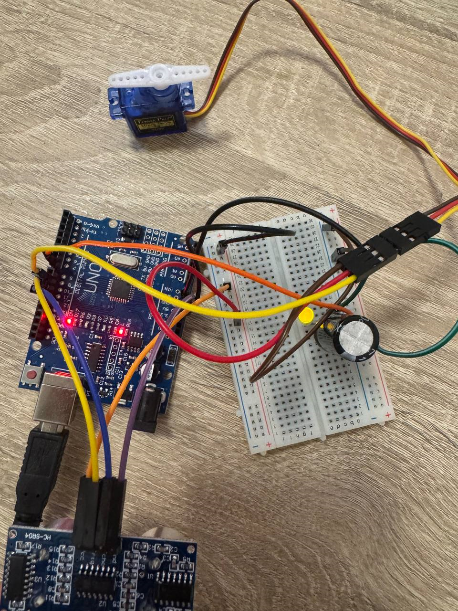
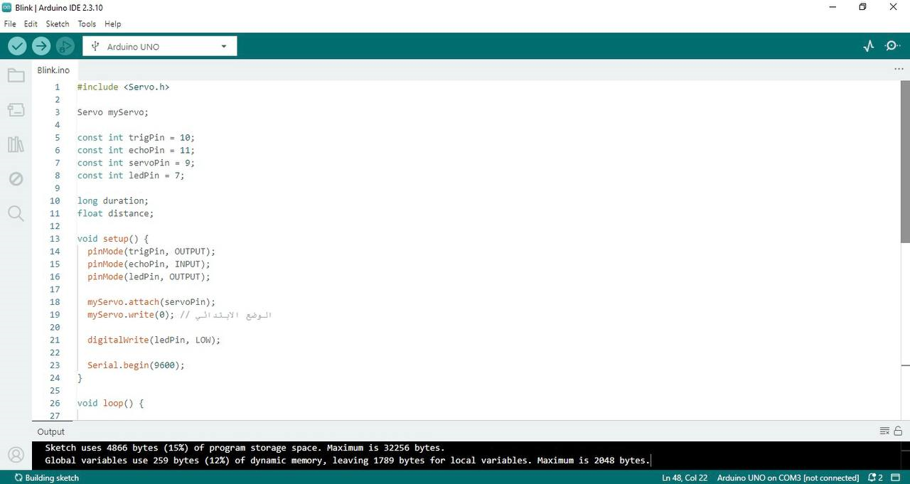
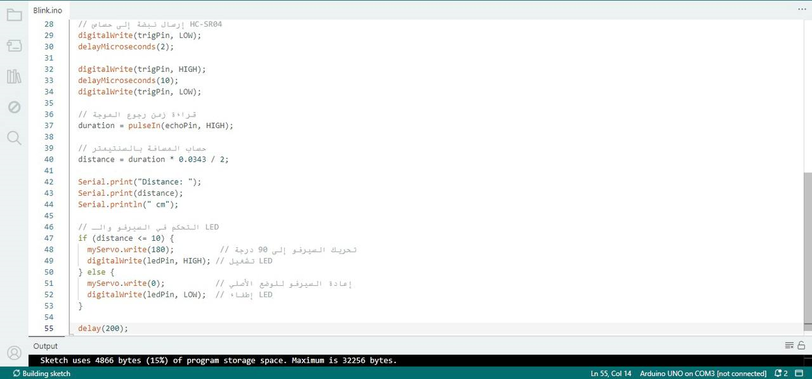
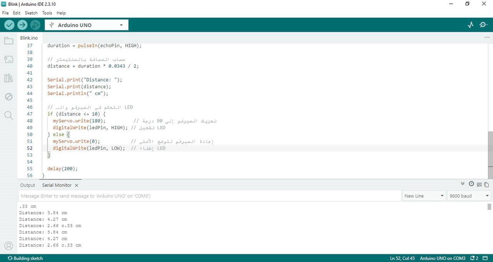

# Arduino Servo Motor Control Using HC-SR04 Ultrasonic Sensor

## Overview

This project demonstrates how to control a servo motor using an HC-SR04 ultrasonic sensor and an Arduino Uno. When an object is detected within 10 cm, the servo motor rotates to 90°. When the object moves away, the servo returns to its original position (0°). An LED is also used as an indicator and turns on when the servo is activated.

---

## Components Used

* Arduino Uno
* HC-SR04 Ultrasonic Sensor
* SG90 Servo Motor
* LED
* 220Ω Resistor
* Breadboard
* Jumper Wires

---

## Pin Connections

| Component | Arduino Pin |
| :--- | :--- |
| Servo Signal | D9 |
| Ultrasonic Trig | D10 |
| Ultrasonic Echo | D11 |
| LED | D7 |
| 5V | Arduino 5V |
| GND | Arduino GND |

---

## How It Works

1. The HC-SR04 sensor continuously measures the distance to nearby objects.
2. If the measured distance is 10 cm or less, the servo motor rotates to 90° and the LED turns on.
3. If the distance becomes greater than 10 cm, the servo returns to 0° and the LED turns off.
4. The measured distance is displayed in the Serial Monitor.

---

## Experiment

The project can be tested by changing:

* The servo angle (for example: 45°, 90°, or 180°).
* The activation distance (for example: 10 cm or 15 cm).

This allows observing how the system responds to different values.

---

## Project Files

* Servo_Ultrasonic_Control.ino – Arduino source code.
* circuit_demo.mov – Demonstration video.
* screenshots/circuit.jpg – Hardware setup.
* screenshots/arduino_code_setup.png – Setup section of the code.
* screenshots/arduino_code_loop.png – Loop section of the code.
* screenshots/serial_monitor_output.png – Serial Monitor output.

---

## Screenshots

### Hardware Setup

### Arduino Code (Setup)

### Arduino Code (Loop)

### Serial Monitor

---

## Demonstration Video

The demonstration video is available in this repository:

* [circuit_demo.mov](circuit_demo.mov)

---

## Author

Developed as part of an Arduino electronics training task using Arduino Uno, HC-SR04 Ultrasonic Sensor, Servo Motor, and LED.
